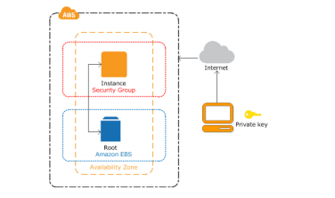
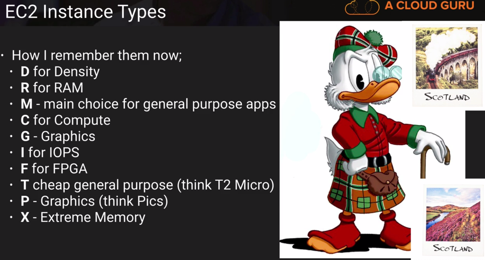

### EC2 - Elastic Compute Cloud

http://docs.aws.amazon.com/AWSEC2/latest/UserGuide/ec2-ug.pdf

	

	

#### Part 1 
> Amazon Elastic Compute Cloud(Amazon EC2) is a web service that provides resizable compute capacity in the cloud. 
> Amazon EC2 reduces the time required to obtain and boot new server instances to minutes, allowing you to quickly
> scale capacity, both up and down, as your computing requirements change.

#### Pricing Options:
- `On Demand` - allow you to pay a fixed rate by the hour with no commitment
	- Users that want low cost and flexibility of Amazon EC2 without any up-front payment or long-term commitment
	- Applications with short term, spiky, or unpredictable workloads that cannot be interrupted
	- Applications being developed or tested on Amazon EC2 for the first time
- `Reserved` - provide you with a capacity reservation, and offer a signification discount on the hourly
	charge for an instance. 1 Year or 3 Year Terms
	- Applications with steady state or predictable usage
	- Applications that require reserved capacity
	- Users able to make upfront payments to reduce their total computing costs even further
- `Spot` - enable you to bid whatever price you want for instance capacity, providing for even greater savings 
	if your application have flexible start and end times.
	- Application that have flexible start and end times
	- Applications that are only feasible at very low compute prices
	- Users with urgent computing needs for large amounts of additional capacity
	- Exam Tip
		- If the Spot instance is terminated by Amazon EC2, you will not be charged for a partial hour of usage.
		- However, if you terminate the instance yourself, you will be charged for any hour in which the instance ran
- `Dedicated Hosts` - Physical EC2 server dedicated for your use. Dedicated Hosts can help you reduce costs	
	by allowing you to use your existing server-bound software licenses.
	- Useful for regulatory requirements that may not support multi-tenant virtualization
	- Great for licensing which does not support multi-tenancy or cloud deployments
	- Can be purchased On-Demand(hourly)
	- Can be purchased as a Reservation for up to 70 % off the On-Demand price
	
	

	

##### DIRTMCGFPX
##### DR Mc GIFT PX

	

	
#### Exam Tips EC2
1. Know the differences between:
	- On Demand
	- Spot
	- Reserved
	- Dedicated Hosts
2. Remember with the spot instances
	- If you terminate the instance, you pay for the hour
	- If AWS terminates the spot instance, you get the hour it was terminated on for free
	
#### How to connect through ssh	
- chmod 400 *.pem 
- ssh ec2-user@public_ip -i *.pem 
- yum install httpd -y
- service httpd start
- cd /var/www/html/
- nano index.html

chkconfig httpd on - run automatically
