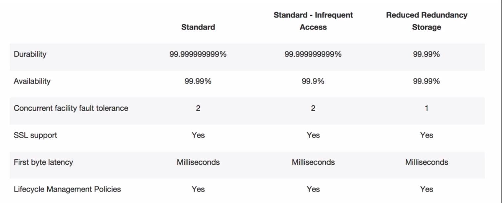
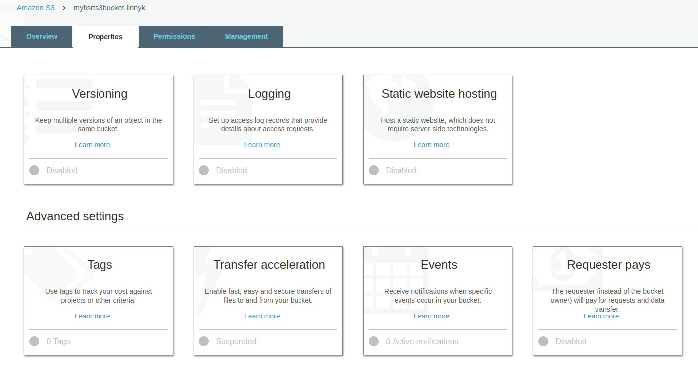
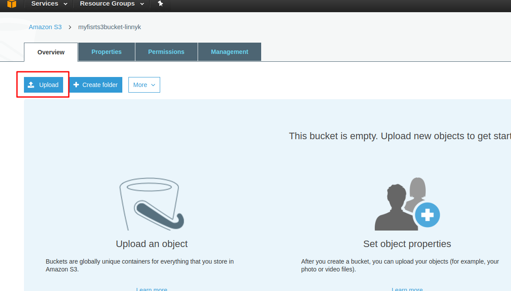
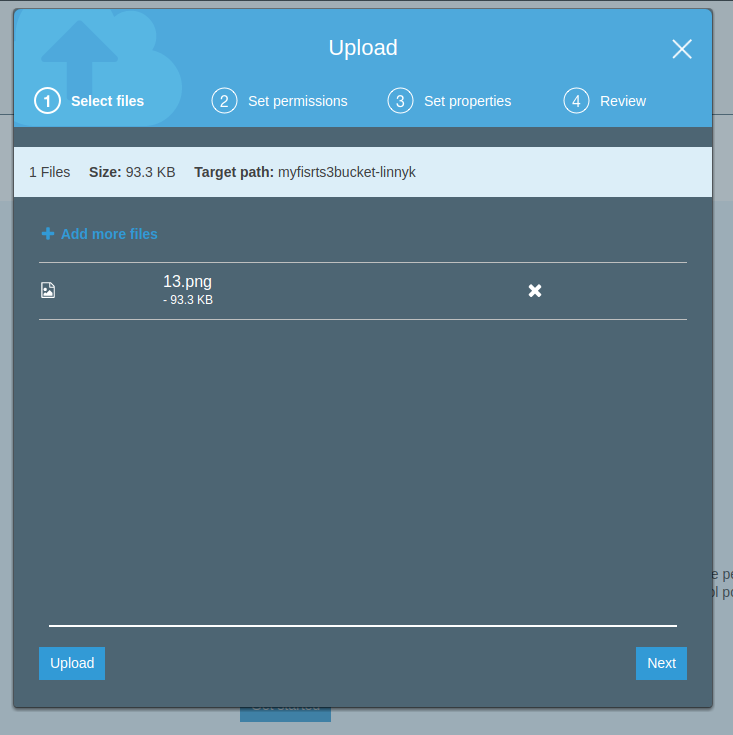
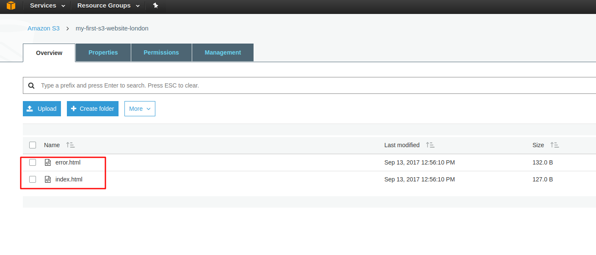
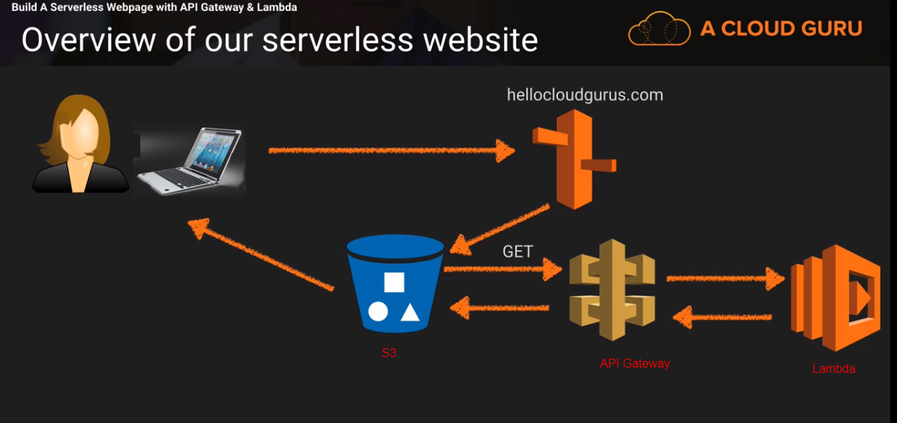
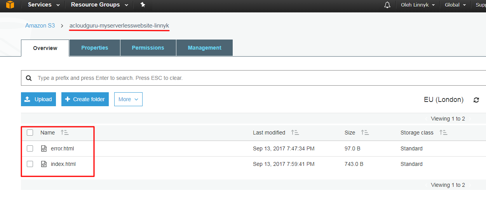
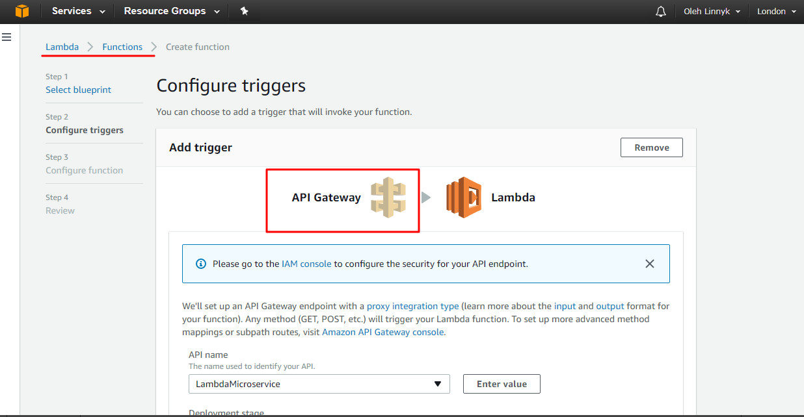

### S3 

http://docs.aws.amazon.com/AmazonS3/latest/gsg/s3-gsg.pdf

**The Basics**
- S3 is Object based i.e. allows you to upload files
- Files can be 0 Bytes to 5 TB
- There is unlimited storage
- Files are stored in Bucket(Folder)
- S3 is a universal namespace, that is, name must be unique globally
- When you upload a file to S3 you will receive a HTTP 200 code if the upload was successful
- Built for 99.9% availability for the S3 platform
- Amazon Guarantee 99.9% availabilityAmazon guarantees 99.99999999% durability for S3 information (11 * 9's)
- Tiered Storage Available
- Lifecycle Management
- Versioning
- Encryption
- Secure your data using Access control Lists and Bucket Policies

**Data Consistency Model For S3**
- Read after Write consistency for PUTS of new Objects
- Eventual Consistency for overwrite PUTS and DELETED (can take some time to propagate)

**S3 - S3 is a simple key, value store**
- S3 is Object based. Objects consist of the following:
	- Key (This is simply the name of the  object)
	- Value (This is simply the data and is made up of a sequence of bytes)
	- Version ID (Important for versioning)
	- Metadata (Data about the data you are storing)
	- Subresources
		- Access Control Lists
		- Torrent
		
**S3 - Storage Tiers/Classes**	
	- S3 - 99.99% availability, 99.9999999% durability, stored redundantly across multiple devices in multiple facilities and 
	is designed to sustain the loss of 2 facilities concurrently
	- S3 - IA (Infrequently Accessed) For data that is accessed less frequently, but requires rapid access when needed.
	 Lower fee that S3, but you are charged a retrieval fee.
	- Reduced Redundancy Storage - Designed to provide 99.999% durability and 99.99% availability of objects over a given year.
	- Glacier - very cheap, but used for archival only. It takes 3 - 5 to restore from Glasier.
	

**S3 - Charges**
- Charged for
	- Storage
	- Requests
	- Storage Management Pricing
	- Data Transfer Pricing
	- Transfer Acceleration 
	
	

	

**Exam tips**
- Remember that S3 is Object based i.e. allows you to upload files (Files, videos, pictures)
- Not suitable to install an operation system or data base
- There is unlimited storage
- Files are stored in Buckets (Folders)
- S3 is a universal namespace, that is, names must be unique globally
- Read after Write consistency for PUTS of new Objects
- Eventually Consistency for overwrite PUTS and DELETES (can take some time to propagate)
- S3 Storage Classes/Tiers
	- S3 (durable, immediately available, frequently accessed)
	- S3 - IA (durable, immediately available, infrequently accessed)
	- S3 - Reduced Redundancy Storage (data that is easily reproducible, such as thumb nails etc)
	- Glacier - archived data, where you can wait 3 - 5 hours before accessing
- Remember the core fundamentals of an S3 objects
	- Key (name)
	- Value(data)
	- Version ID
	- Metadata
	- Subresources
		- ACL
		- Torrent
- Successful uploads will generate a HTTP 200 status code
- Read the S3 FAQ before taking the exam. It comes up A LOT!

**How to create bucket**

	

	

Name of bucket must be:
- unique
- lowercase

	

	
	
How to upload a file
	
	
	
	

	
	
	
	
	

	

	

**Hosting static web site**

	

	

**Build A Serverless Webpage**

