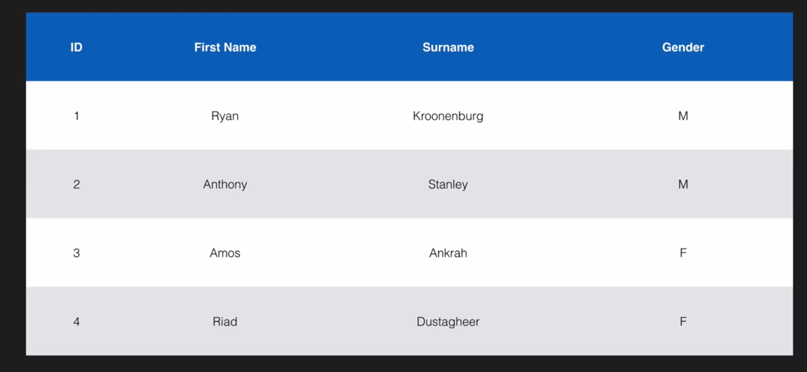
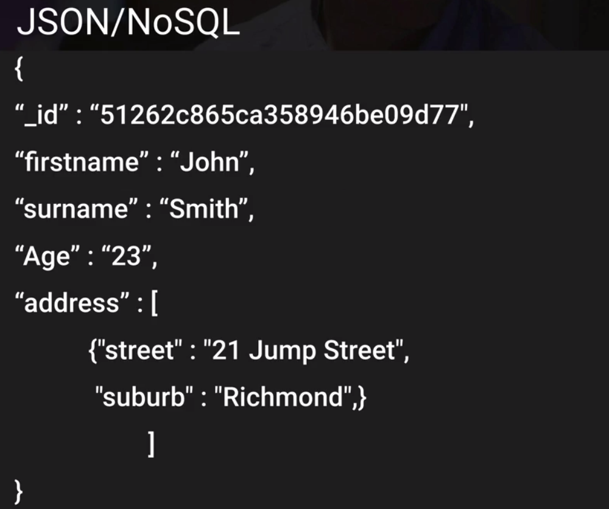

- What is a relational databases?
	- Relational databases are what most of us are all used to. 
	  They have been around since the 70's. Think of a traditional spreadsheet:
	  	- Database
	  	- Tables
	  	- Row
	  	- Fields (Columns)
	  	
	  	

- Relational Database Types
	- SQL Server
	- Oracle
	- MySQL Server
	- PostgreSQL
	- Aurora
	- MariaDB
	
- Non Relational Database Types
	- Database
		- Collection 	  = Table 
		- Document   	  = Row
		- Key Value Pairs = Fields
		
	  
			

- What is Data Warehousing

	Used for business intelligence. Tools like Congos, Jaspersoft, SQL Server Reporting Services, Oracle Hyperio, SAP NetWeaver
	
	Used to pull in very large and complex data sets. Usually used by management to do queries on data (such as current performance vs targets etc)
	
- OLTP vs OLAP	

	Online Transaction Processing (OLTP) differs from OLAP Online Alalytics Processing (OLAP) in terms of the types of queries run
	
	- OLTP Example:
	
		Order number 2120121
		
		Pulls up a row of data such as Name, Date, Address to Deliver to, Delivery Status etc
		
	- OLAP Example:
		
		Net profit for EMEA and Pacific for the Digital Radio Products
		
		Pulls in large numbers of records
		
		Sum of Radios Sold in EMEA
		
		Sum of Radios Sold in PAcific
		
		Unit Cost of Radio in each region
		
		Sales price of each radio
		
		Sales price - unt cost
		
		Data Warehousing databases use different type of architecture both from a database perspective and infrastructure layer
		
- What is ElastiCashe
		
	ElastiCache is a web service that makes it easy to deploy, operate, and scale an in-memory cache in the cloud.
	The service improves the performance of web applications by allowing you to retrieve information from fast, managed, 
	in-memory caches, instead of relying entirely on slower disk-based databases. ElastiCache supports two open-source in-memory caching engines:
	- Memcached
	- Redis
	
- What is DMS?
	
	Announced ar re:Invent 2015, DMS stands for Database Migration Service.
	Allows you to migrate your production database to AWS. 
	Once the migration has started, AWS manages all the complexities of the migration process like data type transformation, compression, and 
	parallel transfer (for faster data transfer) while ensuring that data changes to the source database that occur
	during the migration process are automatically replicated to the target
	
	Aws schema conversion tool automatically converts the source database schema and a majority of the custom code, 
	including views, stored procedures, and functions, to a format compatible with the target database
	
- AWS Database Types - Summary
	- RDS OLTP
		- SQL
		- MYSQL
		- PostgreSQ
		- Oracle
		- Aurora
		- MariaDB
	- DynamoDB - No SQL
	- RedShift - OLAP
	- ElastiCache - In Memory Caching
		- Memcached
		- Redis
	- DMS	