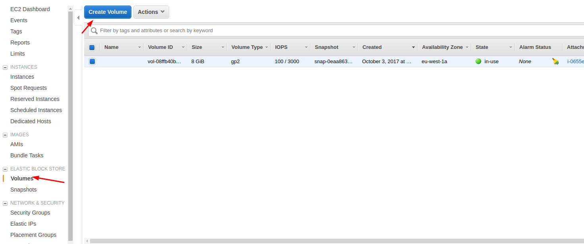
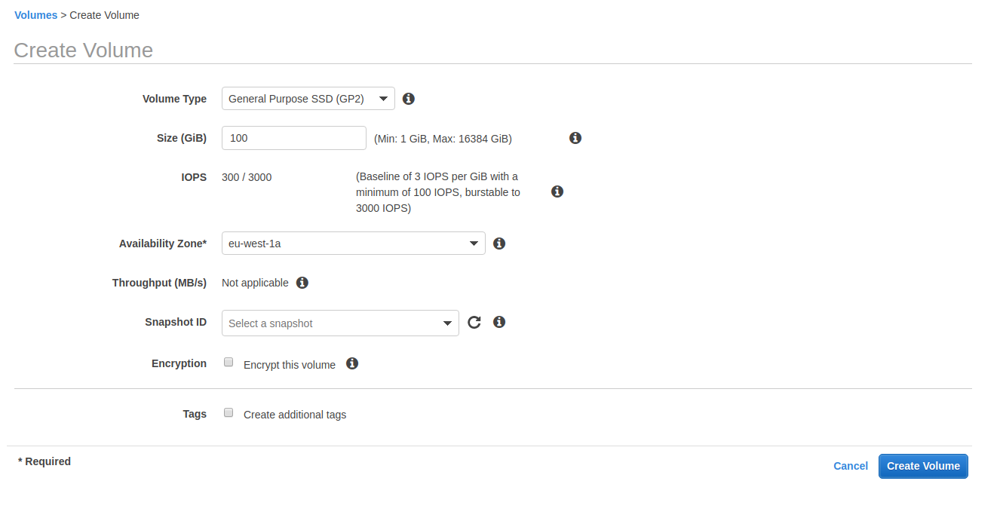
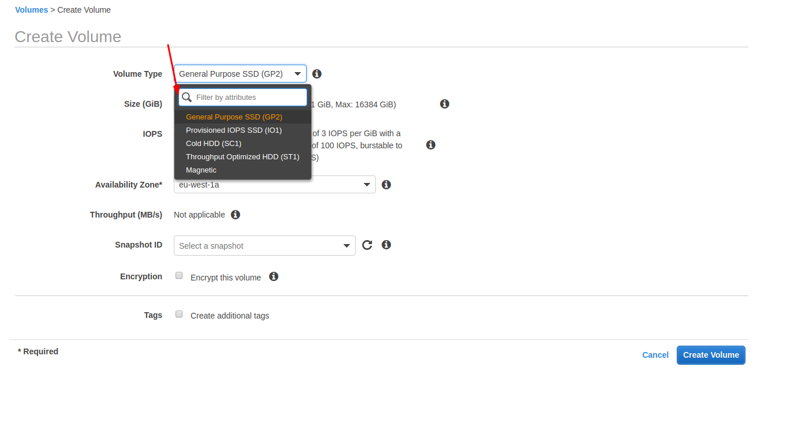
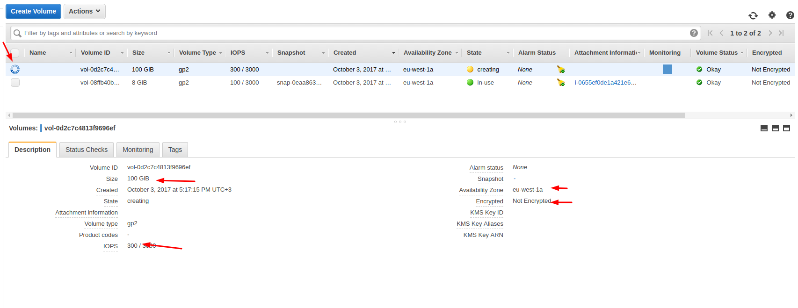

### EBS Elastic Block Store

**Amazon EBS allow you to create storage volumes and attach them to Amazon EC2 instances. Once attached, you can create a file
system on top of these volumes, run a database, or use them in any other way you would use a block device. Amazon EBS volumes
are placed in a specific Availability Zone, where they are automatically replicated to protect you from the failure of a single component.**

**EBS Volume Types**

- `General Purpose SSD (GP2)`
	- General purpose, balances both price and performance
	- Ratio of 3 IOPS per GB with up 10000 IOPS  and the ability to burst up to 3000 IOPS for extended periods of time for volumes under 1 Gib
- `Provisioned IOPS SSD (IO1)	`
	- Designed for I/O intensive applications such as large relational or NoSQL databases
	- Use if you need more then 10000 IOPS
	- Can provision up to 20000 IOPS per volume
- `Throughput Optimized HDD (ST1)`
	- Big Data
	- Data warehouses
	- Log processing
	- Cannot be a boot volume
- `Cold HDD (SC1)`
	- Lowest Cost Storage for infrequently accessed workloads
	- File server
	- Cannot be a boot volume
- `Magnetic (Standard)`
	- Lowest cost per gigabyte of all EBS volume types that is bootable. Magnetic volumes are ideal for workloads where data is accessed infrequently, 
		and applications where the lowest storage is important

**Summary**

- Termination Protection is turned off by default, you must turn it on
- On a EBS-backed instance, the default action is for the root EBS volume to be deleted when the instance is terminated
- EBS Root Volumes of your DEFAULT AMI's (Amazon Machine Image) cannot be encrypted. You can also use a third party tool (such as bit locker etc)
   to encrypt the root volume, or this can be done when creating AMI's (lab to follow) in the AWS console or using the API
- Additional volumes can be encrypted

**Exam tips**

- EBS Volumes can be changed on the fly (except for magnetic standard)
- Best practices to stop the EC2 instance and then change the volume
- You can change volume types by taking a snapshot and then using the snapshot to crate a new volume
- If you change a volume on the fly you must wait for 6 hours before making another change
- You can scale EBS Volumes up only
- Volumes must be in the same AZ(available zones) as the EC2 instances
- EBS Consists:
	- SSD, General Purpose - GP2 - (Up to 10000 IOPS)
	- SSh, Provisioned IPS - IO1 - (More than 10000 IOPS)
	- HDD, Throughput Optimized - ST1 - frequently accessed workloads
	- HDD, Cold - SC1 - less frequently accessed data
	- HDD, Magnetic - Standard - cheap, infrequently accessed storage
- You cannot mount 1 EBS volume to multiple Ec2 instances, instead use EFS 