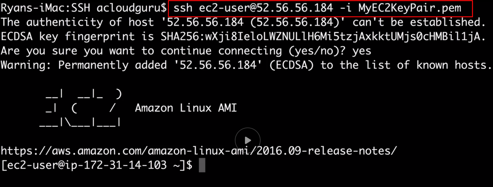

### CLI - Command Line

http://docs.aws.amazon.com/cli/latest/index.html

Define user who has access to EC2 through CLI.

Mostly have to be used when connecting outside.

- `aws s3 help` - help
- `aws configure` - configuring access
	- Enter `AWS Access Key ID`
	- Enter `AWS Secret Access Key`
	- Enter `Default region name`
	- Enter `Default output format`
- `aws s3 ls` - see all buckets
- All configuring is saving on `~/.aws/credentials`
- `aws ec2 describe-instances` - describing all instances
- `aws ec2 terminate-instances --instance-ids InstanceId` - terminate instance by instance Id
- `aws s3 cp --recursive s3://s3-bucket-name /home/ec2-user/` - download data from bucket to ec2
- `aws s3 cp --recursive s3://acloudguru-linnyk-22-nv /home/ec2-user/ --region eu-west-2` - download data from bucket to ec2 with region 

**On Exam**
- `describe-instances` - Describes one or more of your instances. If you specify one or more instance IDs, Amazon EC2 returns 
						 information for those instances. If you do not specify instance IDs, Amazon EC2 returns information for 
						 all relevant instances. If you specify an instance ID that is not valid, an error is returned. 
						 If you specify an instance that you do not own, it is not included in the returned results
- `run-instances` - Launches the specified number of instances using an AMI for which you have permissions. Create a new instance
	- `aws ec2 run-instances --image-id ami-165a0876 --count 1 --instance-type t2.micro --key-name MyEC2KeyPair --security-group-ids sg-be0732d7 --subnet-id subnet-6e7f829e`
- `describe-images` - Describes one or more of the images (AMIs, AKIs, and ARIs) available to you. Images available to you 
					 include public images, private images that you own, and private images owned by other AWS accounts but for which you have explicit launch permissions.
- `start-instances` - Starts an Amazon EBS-backed AMI that you've previously stopped. 
	- `aws ec2 start-instances --instance-ids i-1234567890abcdef0`
- `terminate-instances` - Shuts down one or more instances. This operation is idempotent; if you terminate an instance more than once, each call succeeds.
						 If you specify multiple instances and the request fails (for example, because of a single incorrect instance ID), none of the instances are terminated.
						 Terminated instances remain visible after termination (for approximately one hour).
	- `aws ec2 terminate-instances --instance-ids i-00ad7cfe27fa6e65e`
			
