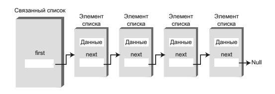

##Linked lists

 - How to run **Linked lists** applet:
 
   ```
   appletviewer http://cs.brynmawr.edu/Courses/cs206/spring2004/WorkshopApplets/Chap05/LinkList/LinkList.html
   ```
   

В связанном списке каждый элемент данных встраивается в специальный объект, называемый элементом списка (классу, на основе которого создаются такие объекты, 
часто присваивается имя Link). Так как список содержит много однотипных элементов, для них удобно создать отдельный класс, отличный от класса самого
связанного списка. Каждый элемент (то есть объект Link) содержит ссылку на следующий элемент списка; поле, в котором эта ссылка хранится, обычно называется
next. 
Объект списка содержит ссылку на первый элемент first.




```java
class Link{
   
    public int iData;    // Данные
    public double dData; // Данные
    public Link next;    // Ссылка на следующий элемент списка

}

```
В списке конкретный элемент можно найти только одним способом: отследив его по цепочке элементов от начала списка. Поиск больше напоминает отношения
между людьми. Допустим, вы спрашиваете Гарри, где находится Боб. Гарри этого не знает, но он думает, что Джейн может вам помочь. Вы идете и спрашиваете
Джейн. Она видела, что Боб уходил из офиса с Салли; вы звоните на сотовый телефон Салли. Оказывается, Салли рассталась с Бобом у офиса Питера... В общем,
вы поняли. Обратиться к элементу данных напрямую невозможно, для поиска приходится использовать отношения между элементами. Вы начинаете с первого
элемента, переходите ко второму, потом к третьему — пока не найдете тот, который вам нужен.